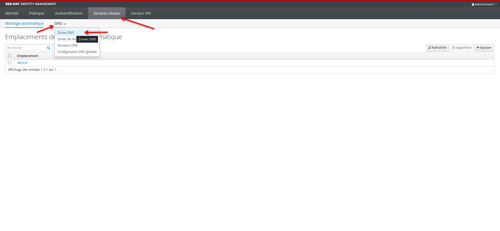
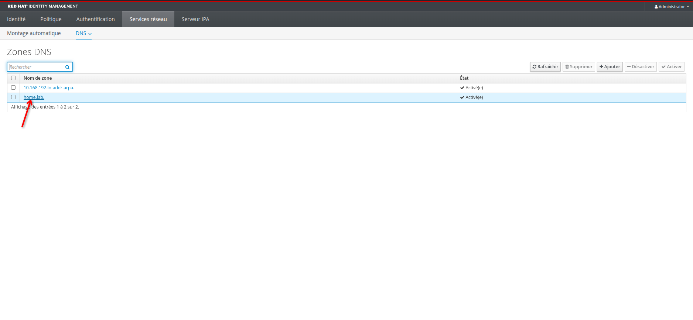
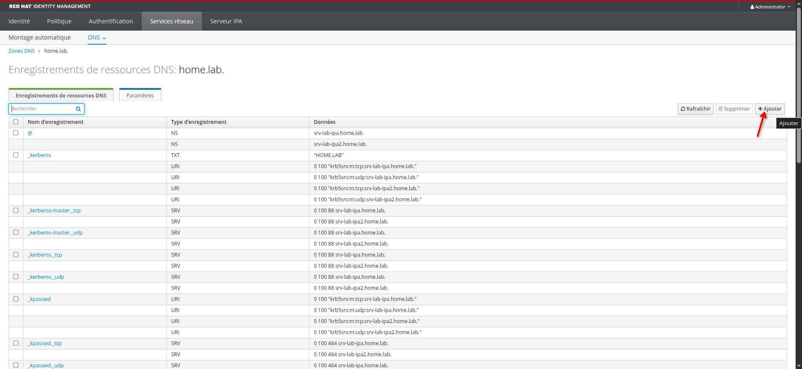
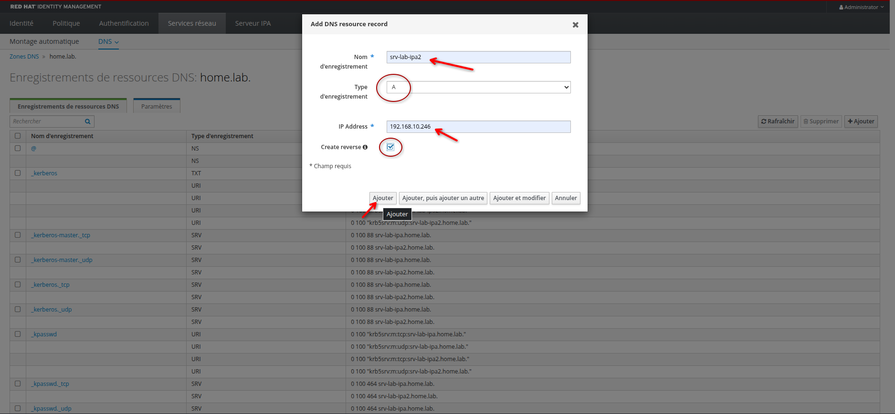
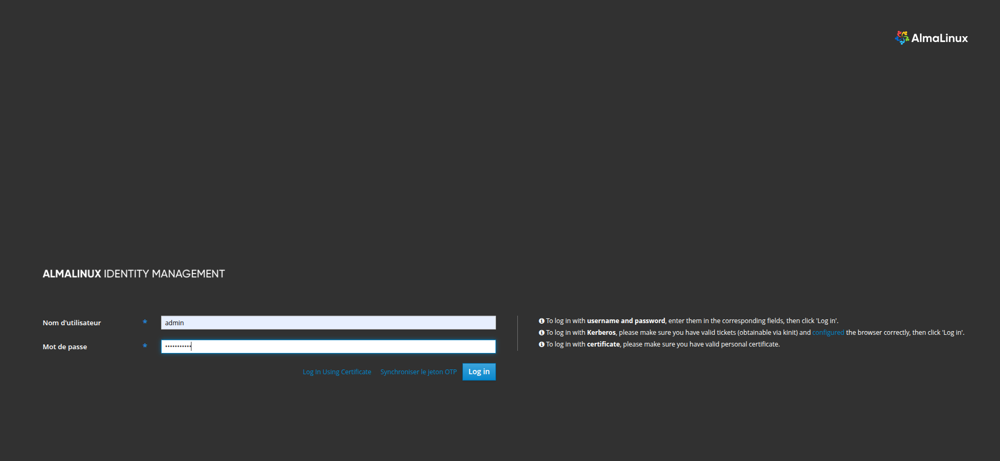
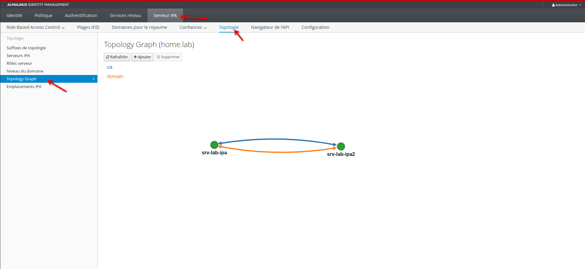

# Ajouter un serveur réplica FreeIPA dans un domaine existant

---

## Objectifs

- Dans un domaine pré-existant, ajouter un serveur FreeIPA comme réplica
- Inclure le service DNS et l'autorité de certification (CA) au réplica
- Appliquer les étapes de configuration nécessaires en amont afin d'obtenir un processus réussi

## Contexte

- Un serveur FreeIPA maître et les droits d'administration
- Un second serveur RHEL (ou clone, AlmaLinux dans ce lab) non joint au domaine sur le même sous-réseau
- Un accès aux consoles d'administration web via un navigateur
- Nom de domaine du lab: home.lab
- Sous-réseau: 192.168.10.0/24
- Passerelle et DNS forwarder: 192.168.10.254

---

## Sur le serveur maître FreeIPA

### Ajouter les enregistrements DNS pour le réplica

- Se connecter à l'interface web d'administration du serveur maître

Dans l'onglet "Services réseau" et "Zones DNS"



Sélectionner le nom de domaine concerné



Ajouter un nouvel enregistrement



Renseigner le nom d'hôte du serveur réplica ainsi que son adresse IP et cocher la case "Create reverse"



Cette opération va ajouter les entrées A et PTR pour le serveur réplica dans le DNS du serveur maître, elle peut également être réalisée via la cli avec les commandes suivantes
```bash
ipa dnsrecord-add home.lab srv-lab-ipa2 --a-rec 192.168.10.246
ipa dnsrecord-add 10.168.192.in-addr.arpa 246 --ptr-rec srv-lab-ipa2.home.lab.
```

### Créer l'hôte qui sera le serveur réplica

Via un accès ssh au serveur

- Obtenir un ticket Kerberos avec un compte administrateur du domaine, ici `admin`
```bash
kinit admin
```
Vérifier l'obtention
```bash
klist
```

- Créer l'hôte avec un mot de passe machine temporaire et aléatoire
```bash
ipa host-add srv-lab-ipa2.home.lab --random
```
Copier le mot de passe temporaire qui devra être utilisé ultérieurement

- Puis l'ajouter au groupe `ipaservers`
```bash
ipa hostgroup-add-member ipaservers --hosts srv-lab-ipa2.home.lab
```

---

## Sur le serveur réplica

- Définir le nom d'hôte de la machine et le DNS

```bash
sudo -i
hostnamectl set-hostname srv-lab-ipa2
vim /etc/hosts
```
Ajouter les entrées pour le serveur FreeIPA maître et la machine locale
```
192.168.10.245  srv-lab-ipa.home.lab    srv-lab-ipa
192.168.10.246  srv-lab-ipa2.home.lab    srv-lab-ipa2
```
Configurer le serveur DNS comme étant le serveur FreeIPA maître (temporaire)
```bash
echo "search home.lab" >> /etc/resolv.conf
echo "nameserver 192.168.10.245" >> /etc/resolv.conf
```

- Installer les paquets nécessaires

```bash
dnf install ipa-server ipa-server-dns -y
```

- Ouvrir les ports utilisés par les services à installer

```bash
firewall-cmd --add-service=http --add-service=https --add-service=ldap --add-service=ldaps --add-service=kerberos --add-service=ntp --permanent
firewall-cmd --add-port=53/tcp --add-port=53/udp --add-port=88/tcp --add-port=464/udp --add-port=464/tcp --add-port=8443/tcp --permanent
firewall-cmd --reload
```

- Installation du réplica

Utiliser le mot de passe temporaire copié à l'étape précédente
```bash
ipa-replica-install --password 6Ro3MwYU2oC3b4mCMrSNkAl --setup-dns --setup-ca --forwarder 192.168.10.254 --no-reverse
```

## Vérification de la topologie

Se connecter à l'interface web d'administration du serveur réplica `https://srv-lab-ipa2.home.lab/ipa/ui`



Dans l'onglet "Serveur IPA" puis "Topologie", cliquer sur "Topology Graph"



## Conclusion

- En suivant cette procédure il est possible d'ajouter un réplica FreeIPA sans subir les échecs inhérents à une installation mal préparée
- Le réplica fera office de serveur DNS secondaire et d'autorité de certification dans le domaine en cas d'indisponibilité du serveur maître